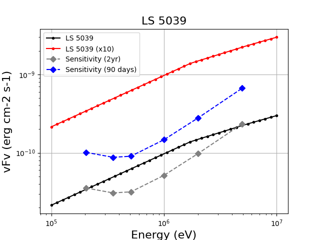
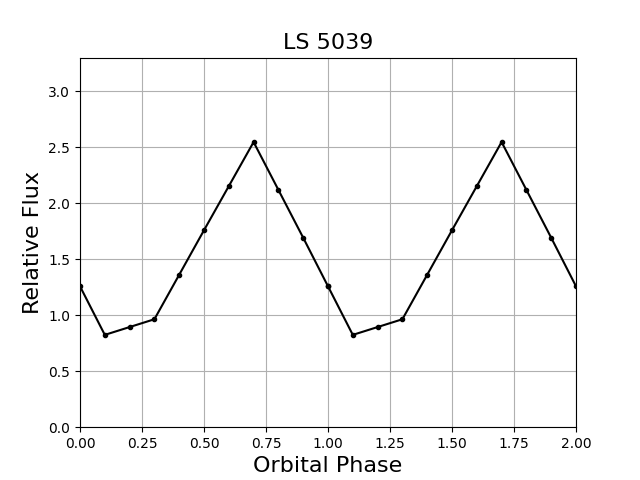

# Gamma-ray Binary LS 5039

**Date**: July 26, 2024

**Author**: Hiroki Yoneda

## Overview
LS 5039 is a TeV gamma-ray binary system with an orbital period of about 3.9 days. 
MeV gamma-ray emission was reported by COMPTEL (1).

## Model Description
- The spectrum was generated by interpolating X-ray spectrum (2) and MeV spectrum (1)
- Used a spectrum averaged over the orbital period
- Orbital modulation is based on the orbital light curve (1)
- Orbital period is 3.90608 days (2)
- Additional model with 10 times higher flux was prepared because the observation time in the DC3 simulation may be shoter than the COSI nominal observation time (2 years), and LS 5039 may not reach to the sensivity.
  
## Goals
1. Establish analysis methods for detecting LS 5039
   - Dedicated data analysis since it is close to the COSI's continuum sensitivity
   - Consideration of contamination from bright objects
2. Obtain an orbital light curve folded with the binary period

## Figures

## References
1. [Collmar and Zhang, 2014](http://adsabs.harvard.edu/abs/2014A%26A...565A..38C)
2. [Yoneda et al. 2021](https://iopscience.iop.org/article/10.3847/1538-4357/ac0ae1/meta)