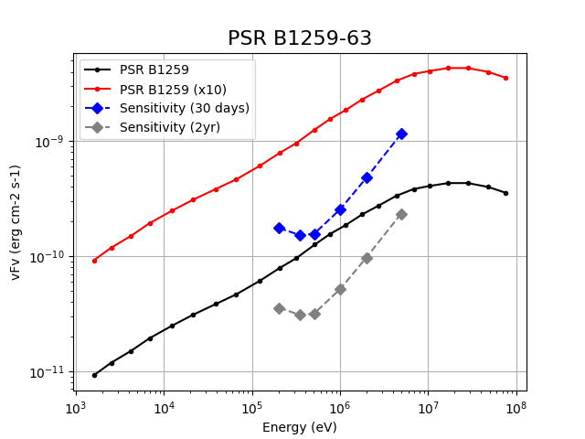
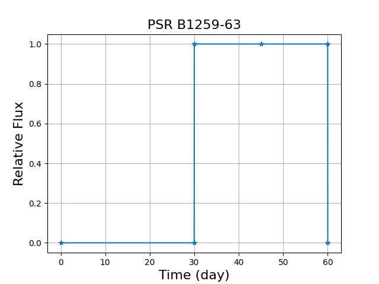

# Gamma-ray Binary PSR B1259-63

**Date**: July 26, 2024

**Author**: Hiroki Yoneda

## Overview
- Orbital period: 3.4 years
- Highly eccentric orbit
- Gamma-ray emission occurs during its periastron passage
- Interaction between radio pulsar and Be star's disk gas triggers particle acceleration

## Upcoming Event
- Next periastron passage: November 19, 2027
- High potential as a COSI observation target

## Model Description
- Based on the Fermi collaboration paper (Figure 5 Bottom, 1)
- For DC3 simulation, I assumed these features:
  - 30-day constant emission
  - Two flux scenarios: 
    1. Same as the Fermi paper
    2. 10x brighter
- Note
  - The flux and duration in COSI's energy band are not well understood.
  - The flux and duration varies for each periastron passage (2).

## Goals

1. Measure MeV gamma-ray flux in the flare event
2. Determine the duration of flare periods

## Figures

## References
1. [Fermi collaboration, 2011](https://doi.org/10.1088%2F2041-8205%2F736%2F1%2Fl11)
2. [Chernyakova, 2021](http://arxiv.org/abs/2106.03759)